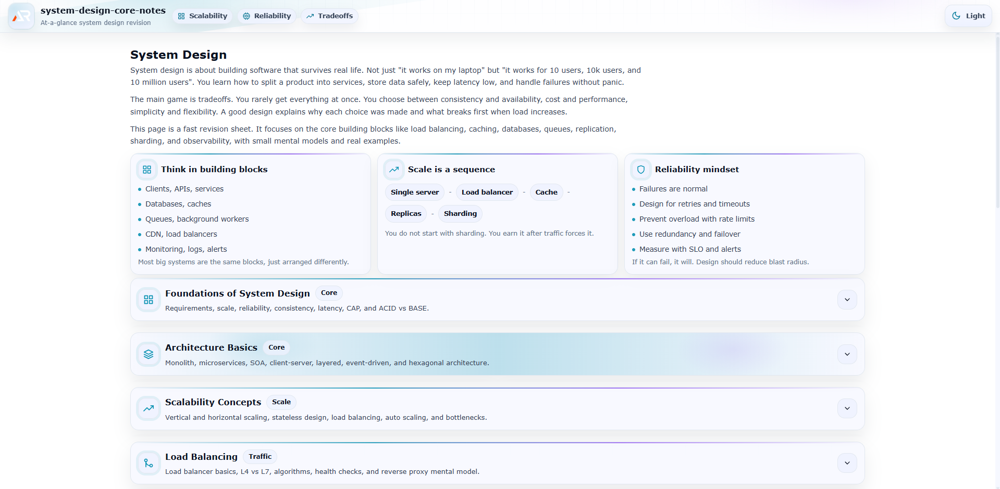

# System Design Core Notes

A single-page, at-a-glance revision project for core System Design concepts.

This project is designed as a fast reference and structured summary sheet covering essential system architecture topics without unnecessary depth.  
It focuses on clarity, scalability thinking, tradeoff analysis, distributed systems behavior, and interview-ready fundamentals.

---



---

## Purpose

- Quick revision before system design interviews
- Rapid recall of architecture fundamentals
- Clear mental model of scaling, reliability, and distributed systems
- Practical, production-focused reminders
- Strong foundation in databases, caching, load balancing, messaging, and high availability without overload

## Coverage

- What is System Design
- Functional vs Non-functional requirements
- Scalability
- Reliability vs Availability
- Latency vs Throughput
- Consistency models
- CAP theorem
- ACID vs BASE

- Architecture Basics
    - Monolith
    - Microservices
    - Service-oriented architecture
    - Client-server model
    - Layered architecture
    - Event-driven architecture

- Scaling
    - Vertical scaling
    - Horizontal scaling
    - Stateless vs Stateful services
    - Bottlenecks
    - Auto scaling

- Load Balancing
    - What is a load balancer
    - Layer 4 vs Layer 7
    - Round robin
    - Least connections
    - IP hash
    - Health checks
    - Reverse proxy

- Caching
    - Why caching is needed
    - Cache-aside pattern
    - Write-through
    - Write-back
    - Cache eviction policies
        - LRU
        - LFU
        - FIFO
    - Redis basics
    - CDN concept

- Databases in System Design
    - SQL vs NoSQL
    - Indexing impact
    - Replication
    - Read replicas
    - Sharding
    - Partitioning
    - Distributed databases

- Data Storage
    - Object storage
    - Blob storage
    - Block storage
    - File storage
    - Data lakes vs Data warehouses

- Messaging and Queues
    - Why queues are needed
    - Synchronous vs Asynchronous communication
    - Message brokers
    - Kafka basics
    - RabbitMQ basics
    - Pub-sub model
    - Event streaming

- API Design
    - REST
    - GraphQL overview
    - gRPC basics
    - Idempotency
    - Rate limiting
    - Pagination strategies

- High Availability and Fault Tolerance
    - Redundancy
    - Failover
    - Circuit breaker
    - Retry pattern
    - Backoff strategy
    - Graceful degradation

- Distributed Systems Concepts
    - Distributed locks
    - Leader election
    - Consensus basics
    - Raft overview
    - Clock synchronization
    - Eventual consistency

- Security in System Design
    - Authentication vs Authorization
    - OAuth basics
    - JWT
    - TLS
    - API gateway
    - Secrets management
    - DDoS mitigation

- Monitoring and Observability
    - Logging
    - Metrics
    - Tracing
    - APM
    - Alerting
    - SLAs
    - SLOs
    - SLIs

- Performance Optimization
    - Connection pooling
    - Compression
    - Lazy loading
    - Batch processing
    - Database optimization basics

- Design Patterns
    - API gateway pattern
    - Sidecar pattern
    - Saga pattern
    - CQRS
    - Event sourcing
    - Strangler pattern

- Real-world Design Examples
    - Design URL shortener
    - Design Twitter
    - Design WhatsApp
    - Design YouTube
    - Design E-commerce system
    - Design Chat system

- Estimation Techniques
    - Traffic estimation
    - Storage estimation
    - Bandwidth calculation
    - Capacity planning basics

- Must-know interview questions and answers

## Tech Stack

- React
- Vite
- styled-components

## Project Type

Single page only  
Section-based navigation  
Searchable and expandable content  
No blog-style content, only structured notes

Each topic is modular and collapsible for fast scanning.

## Run Locally

```bash
npm install
npm run dev
```

## Goal

Complete core System Design knowledge in one scrollable page.

No fluff.
No repetition.
Just architecture-level clarity.
